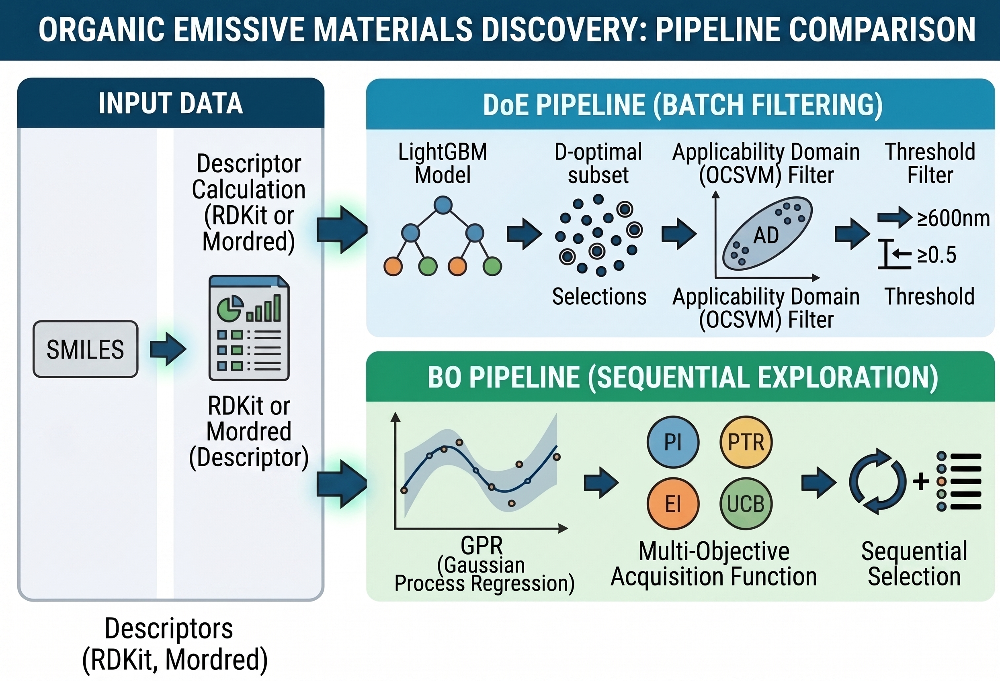
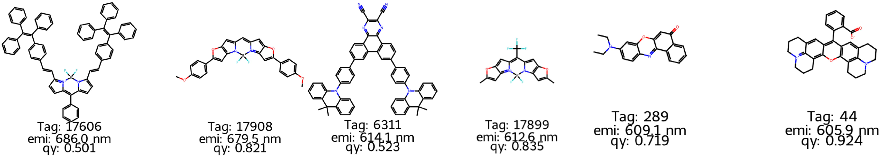
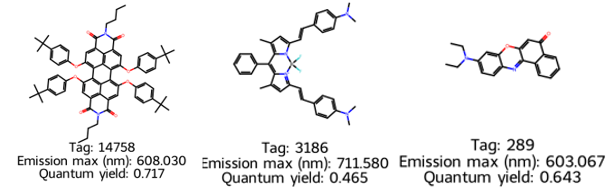
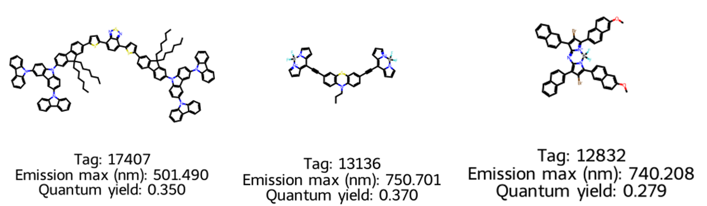
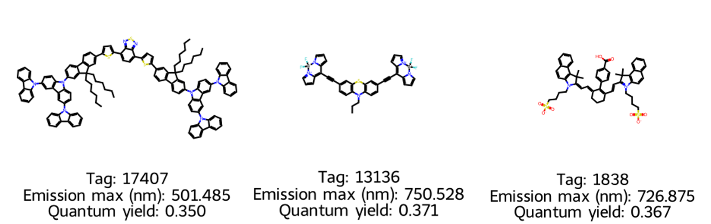
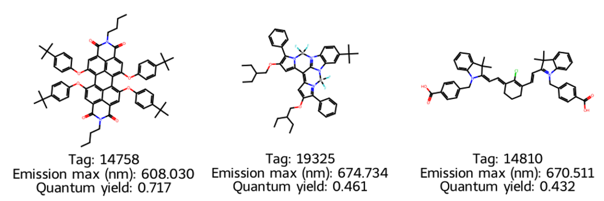

# "LightGBM + AD (DoE)" vs "GPR + Acquisition Function (BO)"


## Summary

This repository provides reproducible notebooks to search for candidate organic emissive materials that satisfy both **long-wavelength emission (Emission max)** and **high quantum yield (Quantum yield / PLQY)** using the Deep4Chem-derived dataset.

The workflow is adapted from Hiromasa Kaneko's book, [*Introduction to Design of Experiments with Python: Data Analysis by Bayesian Optimization*](https://www.amazon.co.jp/%EF%BC%B0%EF%BD%99%EF%BD%84%EF%BD%88%EF%BD%8F%EF%BD%8E%E3%81%A7%E5%AD%A6%E3%81%B6%E5%AE%9F%E9%A8%93%E8%A8%88%E7%94%BB%E6%B3%95%E5%85%A5%E9%96%80-%E3%83%99%E3%82%A4%E3%82%BA%E6%9C%80%E9%81%A9%E5%8C%96%E3%81%AB%E3%82%88%E3%82%8B%E3%83%87%E3%83%BC%E3%82%BF%E8%A7%A3%E6%9E%90-%EF%BC%AB%EF%BC%B3%E6%83%85%E5%A0%B1%E7%A7%91%E5%AD%A6%E5%B0%82%E9%96%80%E6%9B%B8-%E9%87%91%E5%AD%90%E5%BC%98%E6%98%8C-ebook/dp/B09C89HZRV) (the *python_doe_kspub* style), and applied to Deep4Chem data.

The pipeline consists of two major tracks:

1. **DoE track (LightGBM + Applicability Domain)** — Batch prediction on test candidates with a trained LightGBM model, then filtering by D-optimal criterion, OCSVM-AD, and thresholds (`5.Predict_test_LGB.ipynb`)
2. **Bayesian Optimization track (GPR + acquisition functions)** — Sequential candidate selection using uncertainty from Gaussian Process Regression (GPR) under multi-objective settings (`7`, `8` notebooks)

In a broad sense, material search with Bayesian optimization can also be considered DoE (Design of Experiment). In this repository, however, we distinguish them as: "LightGBM + AD" = DoE, and "GPR + acquisition function" = BO. In practical use, both approaches follow an iterative loop: synthesize promising predicted candidates, add experimental results to the dataset, retrain the model, and propose the next candidates.

## Background
### Search Problem

For organic emissive materials, there is demand for strong long-wavelength emission. For example, sensing technologies such as face recognition require efficient near-infrared emission. However, materials with longer wavelength emission often suffer from lower quantum yield due to the **Band gap law**. Therefore, this project maximizes the following two target variables:

| Target variable | Unit | Direction |
|---|---|---|
| Emission max (nm) | nm | Higher is better |
| Quantum yield (PLQY) | 0–1 | Higher is better |

Because chemical space is much larger than the number of feasible experiments, it is crucial to **efficiently prioritize promising candidates with as few experiments as possible**.

### Bayesian Optimization (BO)

Bayesian optimization is a method for expensive black-box functions (here, "descriptors -> properties"), selecting the next experiment point by combining:

1. **Surrogate model** — Predicts target values from known data and estimates **predictive uncertainty**. This repository mainly uses **GPR (Gaussian Process Regression)**.
2. **Acquisition function** — Scores candidates expected to improve, based on surrogate mean and uncertainty.

The key advantage of BO is balancing unexplored high-uncertainty regions (**exploration**) and currently promising regions (**exploitation**). Here, BO is extended to a multi-objective setting to handle emission wavelength and PLQY simultaneously.

| Notebook | Acquisition concept |
|---|---|
| `7.BO_multi_y_multi_sample.ipynb` | Maximize the **sum of log probabilities** (PI / PTR) for objective achievement (following Kaneko's approach) |
| `8.BO_multi_y_multi_sample.ipynb` | **constrained EI** (PLQY EI × in-range emission probability) or **weighted UCB** |


### Acquisition Function Definitions (Implemented in Notebooks 7 and 8)

For each candidate $x$, GPR returns predictive mean $\mu(x)$ and standard deviation $\sigma(x)$ for each objective. $\Phi$ and $\phi$ denote the CDF and PDF of the standard normal distribution, respectively. The implementation uses `scipy.stats.norm`, with default $\texttt{relaxation} = \varepsilon = 0.01$.

#### Common: Goal-attainment probabilities (Notebook 7)

**PI (Probability of Improvement, maximization)** — probability of exceeding the current best observed value

$$
f^{*} = \max_{i \in \text{train}} y_i + \varepsilon \,\mathrm{std}(y_{\text{train}}), \qquad
P_{\mathrm{PI}}(x) = P\bigl(Y(x) > f^{*}\bigr) = 1 - \Phi\!\left(\frac{f^{*} - \mu(x)}{\sigma(x)}\right)
$$

- $f^*$: threshold for judging improvement (best-so-far plus a relaxation term)
- $\varepsilon$: relaxation coefficient (default 0.01)
- $\Phi$: CDF of standard normal distribution
- $\mu(x), \sigma(x)$: GPR predictive mean and predictive standard deviation

---

**PI (minimization)** — when `target_type = -1` in `settings`

$$
f^{*} = \min_{i \in \text{train}} y_i - \varepsilon \,\mathrm{std}(y_{\text{train}}), \qquad
P_{\mathrm{PI}}(x) = P\bigl(Y(x) < f^{*}\bigr) = \Phi\!\left(\frac{f^{*} - \mu(x)}{\sigma(x)}\right)
$$

- $f^*$: threshold for judging improvement (best-so-far minus a relaxation term)
- $\varepsilon$: relaxation coefficient (default 0.01)
- $\Phi$: CDF of standard normal distribution
- $\mu(x), \sigma(x)$: GPR predictive mean and predictive standard deviation

---

**PTR (Probability of Target Range)** — probability that prediction falls within target interval $[y_{\mathrm{low}}, y_{\mathrm{high}}]$

$$
\begin{aligned}
P_{\mathrm{PTR}}(x) &= P\bigl(y_{\mathrm{low}} \le Y(x) \le y_{\mathrm{high}}\bigr) \\
&= \Phi\!\left(\frac{y_{\mathrm{high}} - \mu(x)}{\sigma(x)}\right) - \Phi\!\left(\frac{y_{\mathrm{low}} - \mu(x)}{\sigma(x)}\right)
\end{aligned}
$$

- $y_{\mathrm{low}}, y_{\mathrm{high}}$: lower and upper bounds of target range
- $\Phi$: CDF of standard normal distribution
- $\mu(x), \sigma(x)$: GPR predictive mean and predictive standard deviation

Default `settings` example in Notebook 7: PTR for emission (600–900 nm), PI (maximize) for PLQY.

**Multi-objective score (Notebook 7)** — maximize **sum of log probabilities** (assuming independence)

$$
A_7(x) = \sum_{k=1}^{K} \log P_k(x), \qquad
\text{selection: } \arg\max_x A_7(x)
$$

- $K$: number of objectives (2 in this repository)
- $P_k(x)$: attainment probability for objective $k$ (PI or PTR)

---

#### Components added in Notebook 8

**EI (Expected Improvement, maximization)** — expected improvement using the same $f^*$ as PI

$$
\delta(x) = \mu(x) - f^*, \quad z(x) = \frac{\delta(x)}{\sigma(x)}, \qquad
\mathrm{EI}(x) = \max\!\left(0,\; \delta(x)\,\Phi(z) + \sigma(x)\,\phi(z)\right)
$$

- $\delta(x)$: predicted uplift over threshold $f^*$
- $z(x)$: standardized improvement
- $\Phi$: CDF of standard normal distribution
- $\phi$: PDF of standard normal distribution
- $\mu(x), \sigma(x)$: GPR predictive mean and predictive standard deviation

---

**UCB (Upper Confidence Bound, maximization)**

$$
\mathrm{UCB}(x) = \mu(x) + \kappa\,\sigma(x) \qquad (\kappa = 2.0 \text{ by default})
$$

- $\kappa$: trade-off coefficient between exploration and exploitation (larger = more exploratory)
- $\mu(x), \sigma(x)$: GPR predictive mean and predictive standard deviation

---

**constrained EI (Notebook 8)** — acquisition score defined by **product** of PTR for emission and EI for PLQY

$$
A_{\mathrm{CEI}}(x) = P_{\mathrm{PTR}}^{\mathrm{em}}(x) \times \mathrm{EI}^{\mathrm{PLQY}}(x)
$$

- $P_{\mathrm{PTR}}^{\mathrm{em}}(x)$: probability that emission falls in the target range
- $\mathrm{EI}^{\mathrm{PLQY}}(x)$: expected improvement for PLQY
- $A_{\mathrm{CEI}}(x)$: feasibility-weighted expected improvement score (not a joint probability itself)

---

**weighted UCB (Notebook 8)** — z-score standardization of UCB over candidate set $\mathcal{C}$, then weighted sum

$$
\mathrm{UCB}_k(x) = \mu_k(x) + \kappa\,\sigma_k(x), \qquad
z_k(x) = \frac{\mathrm{UCB}_k(x) - \mathrm{mean}_{x' \in \mathcal{C}}(\mathrm{UCB}_k)}{\mathrm{std}_{x' \in \mathcal{C}}(\mathrm{UCB}_k) + 10^{-12}}
$$

$$
A_{\mathrm{WUCB}}(x) = w_{\mathrm{PLQY}}\, z_{\mathrm{PLQY}}(x) + w_{\mathrm{em}}\, z_{\mathrm{em}}(x)
\qquad (\text{default: } w_{\mathrm{PLQY}} = w_{\mathrm{em}} = 0.5)
$$

- $\mathcal{C}$: candidate set evaluated in that round
- $z_k(x)$: standardized UCB for objective $k$ within candidate set
- $w_{\mathrm{PLQY}}, w_{\mathrm{em}}$: objective weights
- $\kappa$: exploration coefficient in UCB

| Symbol | Notebook 7 | Notebook 8 (`constrained_ei`) | Notebook 8 (`weighted_ucb`) |
|---|---|---|---|
| Emission wavelength | $P_{\mathrm{PTR}}$ (600–900 nm) | $P_{\mathrm{PTR}}$ | $\mathrm{UCB}$ -> $z_{\mathrm{em}}$ |
| PLQY | $P_{\mathrm{PI}}$ | $\mathrm{EI}$ | $\mathrm{UCB}$ -> $z_{\mathrm{PLQY}}$ |
| Combination | $\sum \log P_k$ | Product | Weighted sum |

---

## Experiments (Notebook Structure)

Notebooks are intended to be run in order. Notebook 6 onward covers BO references/production; notebooks 1–5 cover data preparation through DoE-based candidate extraction.

| # | File | Description |
|---|---|---|
| 1 | `notebook/1.Preparation.ipynb` | Load Deep4Chem data, compute RDKit descriptors from SMILES, generate `data/dataset_train.csv` and `dataset_test.csv` |
| 2 | `notebook/2.EDA.ipynb` | Exploratory data analysis: target distributions, descriptor correlations, PCA, etc. |
| 3 | `notebook/3.Regression.ipynb` | Compare/evaluate LightGBM and GPR (CV metrics, kernel selection guidance) |
| 4 | `notebook/4.Finalize_LGB.ipynb` | Optimize LightGBM hyperparameters (Optuna) and save final model |
| 5 | `notebook/5.Predict_test_LGB.ipynb` | **DoE candidate extraction**: LGB prediction -> D-optimal subset -> OCSVM-AD -> threshold filter |
| 6 | `notebook/6.BO_multi-sample.ipynb` | Reference implementation of single-objective BO (either emission **or** PLQY) |
| 7 | `notebook/7.BO_multi_y_multi_sample.ipynb` | **Multi-objective BO (PTR/PI)**: GPR + sum of log probabilities, sequentially selecting 20 candidates |
| 8 | `notebook/8.BO_multi_y_multi_sample.ipynb` | **Multi-objective BO (EI/UCB)**: sequentially selecting 20 candidates with `constrained_ei` or `weighted_ucb` |

### Data
Dataset download URL:

https://figshare.com/articles/dataset/DB_for_chromophore/12045567/2?file=23637518

Download the CSV from the link above, place it in the `data` directory, then run Notebook 1. The notebook splits data into training and test sets.

Note: the original dataset includes a `Solvent` column (solvent used when measuring emission in solution), but this project does not use it. The reason is that although some materials show solvent-dependent shifts, the focus here is the material's intrinsic emission potential. If needed, this can be included as explanatory features (e.g., one-hot encoding) in a more rigorous setup.

- **Training data**: rows with both emission and PLQY available (about 13,000 compounds)
- **Test candidates**: rows with missing PL data (about 7,000 compounds) — from which next experimental candidates are selected
- **Descriptors**: RDKit or Mordred descriptors (choose either; Mordred is higher-dimensional and the calculation cost is high)

### Outputs

Results from BO notebooks (7, 8) are saved as CSV files under `notebook/outputs/result/`.

| Example file | Description |
|---|---|
| `next_samples_*.csv` | Descriptors of selected next candidates |
| `bo_selected_summary_*.csv` | Per-round predictive mean, standard deviation, and acquisition score |
| `estimated_y_prediction_*.csv` | GPR predictions for all candidates |
| `estimated_y_prediction_multi_y_std_*.csv` | GPR predictive standard deviations for all candidates |

---

## Results

Below is a **preliminary baseline-level** comparison when running each notebook with default settings. Values are based on notebook outputs and saved CSV files.

### Comparison Overview

| Item | Notebook 5 (DoE / LGB) | Notebook 7 (BO / PI-PTR) | Notebook 8 (BO / EI-UCB) |
|---|---|---|---|
| Prediction model | LightGBM | GPR (single kernel) | GPR (single kernel) |
| Candidate selection | D-optimal -> AD -> threshold filter (post-hoc) | Sum of log attainment probabilities -> sequential BO | constrained EI / weighted UCB -> sequential BO |
| Input candidate count | 3,500 (downsampled from 7,104 by D-optimal) | 7,104 (all test candidates) | 7,104 (all test candidates) |
| Final selected count | **23** | **20** | **20** |
| Use of uncertainty | None (AD only) | GPR std -> PI/PTR | GPR std -> EI/UCB |
| Multi-objective handling | AND filter after prediction | Sum of log probabilities | EI × feasibility probability, or weighted UCB |

### Threshold Conditions (Shared Target Specification)

In Notebook 5, the following conditions are applied to **predicted values**:

- Emission max >= **600 nm**
- Quantum yield >= **0.5** (50%)

In Notebook 7, `settings` uses emission **600–900 nm (PTR)** and PLQY **(PI, maximize)**. In Notebook 8, `constrained_ei` multiplies PLQY EI by the probability that emission is within 600–900 nm.

### Discussion
**[Notebook 5_DoE]**     
23 candidates were extracted, but excluding solvent variants, there were effectively 6 unique structures. Representative structures are shown below.     
Considering both emission wavelength and quantum yield, `17908` appears to be a promising candidate.


**[Notebook 7_PTR]**     
Using PTR for both emission and PLQY, 20 candidates with a large product of acquisition functions were extracted. In practice, only 3 unique structures were present. Representative structures are shown below. `14785` had the largest acquisition-function product but was predicted on the shorter-wavelength side. `3186` was selected as a secondary candidate; it was long-wavelength but had low quantum yield. `289` was also selected by the DoE method.


**[Notebook 7_PI]**      
Using PI for emission (probability of improving the best value) and PTR for PLQY, 20 candidates with a large product of acquisition functions were extracted. This method yielded higher structural diversity, with no duplicated structures (excluding solvent differences). Representative candidates are shown below. `17407` had the largest acquisition-function product despite a short-wavelength prediction. The selected set tended to have relatively low quantum yield overall (around 0.35). PI values were smaller than PTR (PTR about 0.5 vs PI max about 0.1), and predictive standard deviations were larger, indicating a more exploration-oriented selection.


**[Notebook 8_UCB]**  
This method also selected 20 diverse candidates, but the trend was similar to Notebook 7_PI. Representative candidates are shown below. The highest weighted UCB was `17407`, which was also selected by PI. However, its `std` was very large (338 nm), so the uncertainty term strongly inflated its score. In other words, it may have been selected mainly due to uncertainty rather than predictive value. In contrast, `13136` and `1838` had longer predicted wavelengths with moderate `std` values (around 60–70 nm); although their scores were lower than `17407`, they appear more plausible. Notably, `1838` (second-longest predicted wavelength) was also selected by PI.


**[Notebook 8_EI]**  
Finally, EI-based results are shown. Several candidates shared the same structure, but diversity was higher than Notebook 7_PTR. `14758` had the highest acquisition score (EI × PTR). This method did not produce predictions above 700 nm; the longest predicted wavelength was 674 nm for `19325`. Overall, the behavior was not overly exploratory and was relatively exploitation-oriented.



## Conclusion

- **DoE track** — No candidates exceeded 700 nm emission, but candidates with a good balance with quantum yield were obtained
- **BO track** — Candidates exceeding 700 nm emission were found, but depending on acquisition function choice, the behavior can become strongly exploration-biased and requires caution

## Environment Setup

### Prerequisites

- [Conda](https://docs.conda.io/) or [Mamba](https://mamba.readthedocs.io/) available
- Jupyter Lab / Notebook available

### Create Conda Environment

Create an environment from `environment.yml` at the repository root:

```bash
conda env create -f environment.yml
conda activate chem_win
```

Main dependencies in `environment.yml`:

| Category | Packages |
|---|---|
| Python | 3.11 |
| Numeric / ML | numpy, pandas, scipy, scikit-learn, lightgbm, joblib |
| Cheminformatics | rdkit, mordred |
| Visualization | matplotlib, seaborn, py3dmol |
| Optimization | optuna |

### Minimal Run Procedure

```bash
conda activate chem_win
cd notebook
jupyter lab
```

1. Run from `1.Preparation.ipynb` in order (descriptor calculation may take time)
2. DoE only: `4.Finalize_LGB.ipynb` -> `5.Predict_test_LGB.ipynb`
3. BO only: `6` (optional) -> `7` or `8`

## Citation

The Bayesian optimization and DoE concepts in this repository are based on the following book and sample code:

> Hiromasa Kaneko, **Introduction to Design of Experiments with Python — Data Analysis by Bayesian Optimization** (KS Information Science Series)  
> [Amazon.co.jp link](https://www.amazon.co.jp/%EF%BC%B0%EF%BD%99%EF%BD%84%EF%BD%88%EF%BD%8F%EF%BD%8E%E3%81%A7%E5%AD%A6%E3%81%B6%E5%AE%9F%E9%A8%93%E8%A8%88%E7%94%BB%E6%B3%95%E5%85%A5%E9%96%80-%E3%83%99%E3%82%A4%E3%82%BA%E6%9C%80%E9%81%A9%E5%8C%96%E3%81%AB%E3%82%88%E3%82%8B%E3%83%87%E3%83%BC%E3%82%BF%E8%A7%A3%E6%9E%90-%EF%BC%AB%EF%BC%B3%E6%83%85%E5%A0%B1%E7%A7%91%E5%AD%A6%E5%B0%82%E9%96%80%E6%9B%B8-%E9%87%91%E5%AD%90%E5%BC%98%E6%98%8C-ebook/dp/B09C89HZRV)
